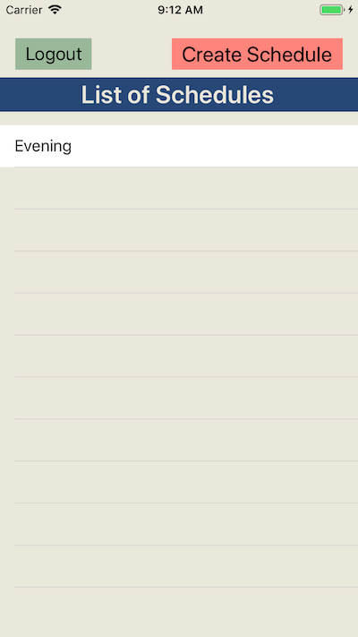
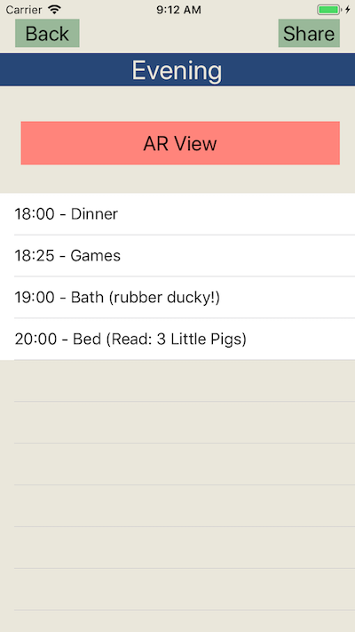

# L.A.M.A_Baby
An app to create an Augmented Reality map of your home to help carers find things around it. 

# The Concept
The original concept was to create an app so that you could create a sort-of treasure map of your hoem to make sure that a babyistter would have no trouble locating things around the home for your child: little Timmy needs medicine. Which drawer did mum say it was in, again?

So we thought that Augmented Reality could solve that problem as you swing the app around a room, it'll recognise pre-supplied image objects then point to say, here's the medicine with a A.R. arrow. These A.R. items could then be linked to a schedule (like a todo list), so when it's time for Timmy' bath, the app would alert you about this, then show you useful bathtime items and their location in A.R.

Once we got to that point we had talked about scaling the idea back a bit so that it could be used not just for baby-sitters but on account of the two days lost to bank holidays, we ran out of time to really extend and perfect this app.

As it stands, we got the A.R. to recognise pre-supplied images and super-impose a red arrow to point at the item it recognised. The arrow follows the image if moved around in front of the camera.




## Technologies
- Apple Xcode 10.2
- Swift 5
- Apple ARKit 2

## Using the Code
- Clone this repo: ```git clone git@github.com:mmar8/lamababy.git```
- Open the ```LamaBaby.xcodeproj``` workspace in Xcode

## Testing
UI tested with tested with XCTest.

## User Stories
```
As a parent of a child
So I could use an app
I would like to be able to sign up or sign in.

As a parent of a child
So I could use an app
I would like to be able to create a new schedule.

As a parent of a child
So I could use an app
I would like to be able to share the schedule with a carer.


As a carer of a child
So I could use an app
I would like to be able to enter a code and access an app.


As a carer of a child
So I could use an app
I would like to be able to view the schedule of a child.

As a carer of a child
So I could use an app
I would like to be able to view the notes left by the parents.

As a carer of a child
So I could use an app
I would like to be able to use my phone camera to search for things.
```

## Difficulties Encountered
- Learning a new language and testing framework with eight days total
- XCTest can be inconsistent with UI tests, we found
- Getting the A.R. arrow not to impale items it was pointing at (funny to see Trollface with an arrow through his face though)

## Improvements We'd Make
- We'd love to have the A.R. working in to the point where one can use the camera to snap an image (ARReferenceImage) of an object to then be used in the app, without the name to import them into XCode as targets then rebuild the app each time.
- Carers would be able to log-in to see the schedule shared with them as read-only.
- We would have decided on a proper name for the app, instead of leaving it with its codename (each team member's first initial, and "Baby")
- Wire-in something like Firebase to handle auth; right now a username and password is hard-coded in (and this is no bueno at all)